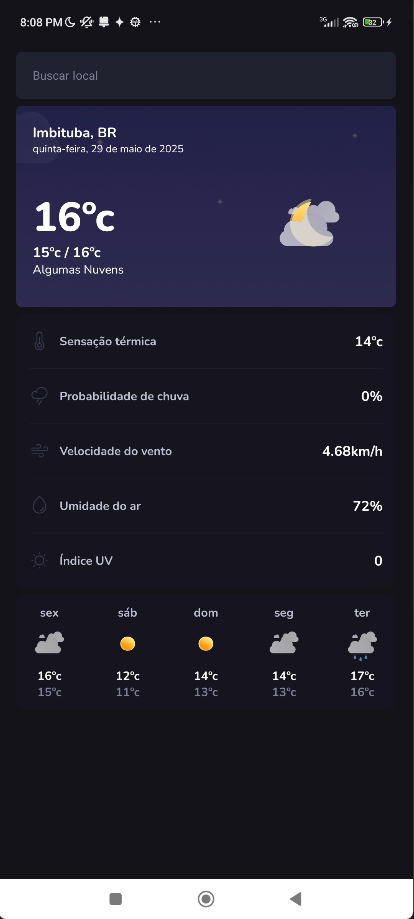

# iWeather - Weather Forecast App

## 📱 Overview

iWeather is a modern weather forecast application that provides real-time weather information for any location. Built with React Native and Expo, this app offers a clean and intuitive interface for users to check current weather conditions and forecasts.

## ✨ Features

- Real-time weather data using OpenWeatherMap API
- Current weather conditions display
- Temperature in Celsius
- Weather descriptions in Portuguese
- Clean and modern user interface
- Responsive design for mobile devices

## 🛠️ Technologies

- React Native
- Expo
- TypeScript
- Axios for API requests
- OpenWeatherMap API

## 🚀 Getting Started

### Prerequisites

- Node.js (LTS version)
- npm or yarn
- Expo CLI
- OpenWeatherMap API key

### Installation

1. Clone the repository:
```bash
git clone https://github.com/yourusername/iweather.git
cd iweather
```

2. Install dependencies:
```bash
npm install
# or
yarn install
```

3. Create a `.env` file in the root directory and add your OpenWeatherMap API key:
```
EXPO_PUBLIC_WEATHER_APP_ID=your_api_key_here
```

4. Start the development server:
```bash
npm start
# or
yarn start
```

## 📸 Screenshots

### Initial Screen


### Home Screen


## 🔧 Environment Variables

The following environment variables are required:

- `EXPO_PUBLIC_WEATHER_APP_ID`: Your OpenWeatherMap API key

## 📝 API Configuration

The app uses the OpenWeatherMap API with the following configuration:
- Base URL: https://api.openweathermap.org/data/2.5
- Language: Portuguese (pt_br)
- Units: Metric (Celsius)

## 🤝 Contributing

Contributions are welcome! Please feel free to submit a Pull Request.

## 📄 License

This project is licensed under the MIT License - see the [LICENSE](LICENSE) file for details.

